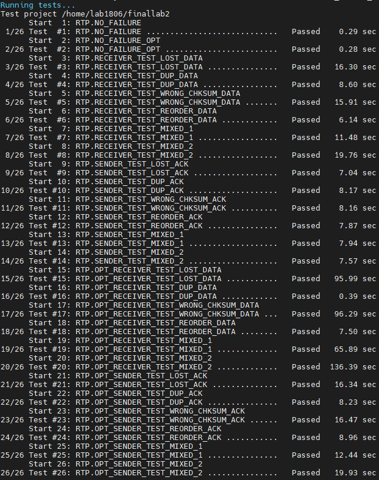

# Lab2 RTP

## 实验概述

本次实验中，我们会实现一个名为RTP的可靠传输协议。不同于lab1使用TCP来实现传输功能，我们这次将会使用UDP作为基本的传输API。所以在这次实验中，我们还需要补全分片、滑动窗口、超时重传等功能，才能在UDP的简陋支持下实现一个可靠传输协议。

## 背景知识

### RTP协议头描述

首先，我们来了解一下RTP的协议头结构：

``` cpp
typedef struct RTP_Header {
    uint8_t type;
    uint16_t length;
    uint32_t seq_num;
    uint32_t checksum;
} rtp_header_t;
```

为了简化操作，RTP头里的所有字段的字节序均是小端法

**type**: 标识了一个RTP报文的类型，0:`START`, 1:`END`, 2:`DATA`, 3:`ACK`，如何使用这些类型请参照后续对lab任务的详细描述

**length**: 标识了一个RTP报文**数据段**的长度（即RTP头后的报文长度），对于`START`,`END`,`ACK`类型的报文来说，长度为0

**seq_num**: 序列号，用于识别顺序做按序送达。每一个报文持有的`seq_num`指明这个报文在整条消息中的次序。例如`seq_num`为0的报文就是第一个报文

**checksum**: 为RTP头以及RTP报文数据段基于32-bit CRC计算出的值，该计算的API已经在xxx文件中提供。

**[?]RTFSC：这个字段在干什么？这个API有什么用？**

> RTFSC的意思是Read The Friendly Source Code，许多问题的答案往往就藏在项目的源代码中。如果你并不清楚这个字段的作用，请翻阅课件，这将直接决定你能否正确的使用我们的提供的API。如果你不清楚这个API究竟做了什么，请直接阅读它的源代码，思考为什么它返回的结果可以作为`checksum`。比起被动的灌输知识，我们认为主动的引导同学们思考能更好的提高大家的水平，所以作为RTFSC的练习，我们将`checksum`字段的维护方式以注释形式插入到了我们的CRC源代码中，只要你忠实地阅读了源码，应该就能正确的实现与`checksum`相关的功能

综上所述，RTP头共计有11个字节，相比之下UDP头有8字节，IP头有20字节。一般在实际的网络中，允许的最大包尺寸不会超过1500字节，如果超过，这些大包会在发送端IP层发出时被自动分片，并在接收端IP层被收取时自动聚合，在传输规模比较大的时候，这些IP层的分片/聚合会带来显著的性能损失。更严重的是，一些网络协议会默认/要求应用层会自己做好分片工作，如果不分片就会让这类协议崩溃。所以我们在发送UDP报文时，需要提前对传输的数据进行分片。根据上述字节数不难得出，我们每个RTP包要携带的数据最多有1500-11-8-20=1461字节

### UDP——最简单的传输层协议

UDP的使用准备和TCP差不多，通过如下流程，即可配置好UDP传输所需的地址信息：

```cpp
sock = socket(AF_INET, SOCK_DGRAM, 0);
bzero(&dstAddr, sizeof(&dstAddr));
dstAddr.sin_family = AF_INET;
inet_pton(AF_INET, receiver_ip, &dstAddr.sin_addr);
dstAddr.sin_port = htons(receiver_port);
```

需要注意的是，UDP不是TCP那样的可靠协议，它的传输并不是可靠的，经过UDP传输的数据可能会发生损坏或者丢包。为了检查UDP是否正确的完成了传输，你可以检查它们的返回值是否和你期望传出/接收的字节数一致：

```cpp
if(size != sendto(sock, (char*)buf, size, MSG_DONTWAIT, (struct sockaddr*)&dstAddr, dstAddrLen)) {...}
if(size != recvfrom(sock, (char*)buf, size, MSG_DONTWAIT, (struct sockaddr*)&srcAddr, &srcAddrLen)) {...}
```

其中，MSG_DONTWAIT表示不阻塞，立即返回执行结果。

## 任务概览

### RTP协议的工作流程

**建立连接** `sender`首先发送一个`type`为`START`，并且`seq_num`为随机值的报文，此后`receiver`应该将带有相同`seq_num`的`ACK`报文发回，`sender`收到`ACK`报文并确认`seq_num`正确后，即认为连接已经建立

**数据传输** 在完成连接的建立之后，要发送的数据由`DATA`类型的报文进行传输。发送方的数据报文的`seq_num`从0开始每个报文递增。注意，数据传输阶段使用的`seq_num`与建立连接时使用的`seq_num`没有联系

**终止连接** 在数据传输完毕后，`sender`发送一个`type`为`END`的报文以终止连接。为了保证所有数据都传输完成，该`END`报文的`seq_num`应当和`receiver`期望收到的下一个报文的`seq_num`相同，在接收到由`receiver`发回的带有相同`seq_num`的`ACK`报文后即认为连接断开

**[!]KISS法则：先完成，再完美**

> 在往年的lab中，总有同学希望一次性写完全部的代码，然后再慢慢debug。但是在面对一些大型项目时，这种做法很容易一口气引入大量的bug，让测试过程变得苦不堪言。KISS的意思是：Keep It Simple and Stupid。在实现复杂逻辑的时候，先从最基本的功能开始搭建，然后立马测试，保证这部分代码正确后，再去实现下一批功能。lab2的代码量或许不大，但它要实现的逻辑比较复杂，按照KISS法则步步为营的推进，可以大大提高开发的效率。

## 任务细节

### 第一部分：实现RTP Sender

#### 功能说明

`sender`应该读取指定的文件，采用RTP协议，通过UDP套接字将其发送到指定的接收方。

首先，`sender`需要按照给定的窗口大小和socket地址，对整个模块进行初始化，并按照如下流程和`receiver`建立连接：

> `sender`发送START报文，其`seq_num`为随机值
> `receiver`返回ACK报文，其`seq_num`与`sender`发出的`START`报文中的`seq_num`一致
> `sender`检查`receiver`发回的报文，如果无误则认为连接建立

在连接成功建立后，`sender`需要根据传入的文件名，将其打开、分片并装入不同的包中。在发送之前，请确保包头的每一个字段都被编辑好了

你需要结合滑动窗口的机制来实现可靠传输，窗口大小`window_size`将会作为`sender`/`receiver`的初始化参数。你需要保证当前正在传输，并且没有被`receiver`确认的报文数量没有超过`window_size`。至于窗口维护的具体细节，就交给同学们自己结合课件思考了

**我可以直接把全部的包都发出去，为什么还要用滑动窗口？**

> 当物理网络的性能所向披靡的时候，这显然是最快最方便的做法。但现实的物理网络并不像行为确定的软件那般可靠，如果短时间内突然涌出来大量的包，网络中的交换机会因为无法缓存而不得不丢弃它们。所以一口气发送全部的包反而可能会导致大量的丢包进而导致重传，适得其反。为了保证每个包都被稳稳地送出去，尽量减少重传的次数，这才引入了滑动窗口，来对网络流量进行控制

`sender`在传输完整个文件后，应该发送一个`END`报文以标记连接的终止。注意，这个报文的`seq_num`依旧符合前述的递增规则，例如最后一个报文的`seq_num`是1000，那么这个END报文的seq_num就应该是1001

`sender`要保证在如下几种网络情况下可以完成可靠传输:

* `sender`传出/receiver`传回的包丢失
* `ACK`报文的乱序到达
* 任意数量的任意报文多次接收
* `ACK`报文的延迟到达
* `receiver`传回的报文损坏

每一个`DATA`报文会被一个`ACK`报文所确认，为了处理`DATA`报文丢失或者`ACK`报文丢失的情况，你需要设置一个计时器以自动重传未被确认的`DATA`报文。

该计时器在滑动窗口发生变化时重置，当该计时器到达100ms的时候，需要将**当前窗口中的所有`DATA`报文**全部重新发送

**[?]STFW：我不会写计时器，怎么办？**

> 我们并不强制要求同学们使用某种特定的计时实现，只要你们能够正确的实现100ms的计时即可。当你面对这种你不知道如何实现的功能时，你可以尝试通过搜索引擎查找“C++ 计时”这样的关键词，再结合你看到的博客和linux man，来完成这部分功能。当你缺乏解决问题的方向时，STFW能很好的启发你。由于Epoll的计时实现比较复杂，如果你选择使用Epoll编程，请参考下方的代码实现计时器：

```cpp
// TODO: add some code here
```

#### 实现要求

你应当在`sender_def.c`程序中实现以下三个函数，其均已在`sender_def.h`中被声明。

``` cpp
/**
 * @brief 用于建立RTP连接
 * @param receiver_ip receiver的IP地址
 * @param receiver_port receiver的端口
 * @param window_size 滑动窗口大小
 * @return -1表示连接失败，0表示连接成功
 **/
int initSender(const char* receiver_ip, uint16_t receiver_port, uint32_t window_size);

/**
 * @brief 用于发送数据
 * @param message 要发送的文件名
 * @return -1表示发送失败，0表示发送成功
 **/
int sendMessage(const char* message);

/**
 * @brief 用于断开RTP连接以及关闭UDP socket
 **/
void terminateSender();
```

> 实现这三个函数的目的是为了方便进行测试，测试程序会直接调用这三个函数，因此请注意不要使用错误的函数定义。注意，你不需要实现一个完整的`sender`，但如果你希望单独执行它们，你也可以使用这三个函数另外实现一个自己的`sender`的可执行程序。在经过lab0的cmake训练后，这对你应该不是问题
> 请不要在函数内部直接使用`exit`等导致**进程**退出的指令，这会导致评测程序也直接停止执行

### 第二部分：实现RTP Receiver

#### 功能说明

`receiver`必须能准确并且完整的收到及储存`sender`所发的信息，然而，我们只需要考虑只存在一个`sender`的情况

`receiver`需要对收到的报文计算其CRC32的`checksum`，对于`checksum`不对的报文应当直接丢弃

对于每一个被确认接收的`START`报文或`END`报文，你需要发送一个`ACK`报文，该报文的`seq_num`已在`RTP技术规范`中描述

对于每一个被确认接收的`DATA`报文，你需要发送一个`ACK`报文，该报文的`seq_num`为当前期望收到的下一个`DATA`报文的`seq_num`

举例而言有如下两种情况(假设期望收到的下一个报文`seq_num为N`):

1. 如果当前报文`seq_num大于且不等于N`: 接收并缓存该报文，并发送一个`seq_num=N`的`ACK`。注意，这与课堂上讨论的Go-Back-N (GBN) 机制略有不同。GBN完全丢弃乱序包，而在这里接收器缓冲乱序包。这里的机制比GBN更有效。

2. 如果当前报文`seq_num等于N`: 发送一个`seq_num=M`的`ACK`，这里`M`为`seq_num`最小的还没有被缓存的报文，并将`M`前所有缓存的报文按序写入文件（包括最新收到的报文）

对于那些`seq_num >= N + window_size`的报文会被直接丢弃，以保证`receiver`的滑动窗口大小不超过`window_size`

#### 实现要求

你应当在`receiver_def.c`程序中实现以下三个函数，其均已在`receiver_def.h`中被声明。

``` cpp
/**
 * @brief 开启receiver并在所有IP的port端口监听等待连接
 * 
 * @param port receiver监听的port
 * @param window_size 滑动窗口大小
 * @return -1表示连接失败，0表示连接成功
 */
int initReceiver(uint16_t port, uint32_t window_size);

/**
 * @brief 用于接收数据并在接收完后断开RTP连接
 * @param filename 用于写入接收数据的文件名
 * @return >0表示接收完成后到数据的字节数 -1表示出现其他错误
 */
int recvMessage(char* filename);

/**
 * @brief 用于接收数据失败时断开RTP连接以及关闭UDP socket
 */
void terminateReceiver();
```

> 实现这三个函数的目的是为了方便进行测试，测试程序会直接调用这三个函数，因此请注意不要使用错误的函数定义。注意，你不需要实现一个完整的`receiver`，当然，为了能够单独执行，你也可以使用这三个函数实现一个自己的`receiver`的可执行程序
> 请不要在函数内部直接使用`exit`等导致**进程**退出的指令，这会导致评测程序也直接停止执行

第三部分：优化RTP Sender/Receiver的重传逻辑

#### 功能说明

在这部分中，你们将对前两部分所写的程序做一些修改。考虑在前面的部分中编写的程序，对于下图中窗口大小为3的以下情况将如何工作:

在这种情况下，`receiver`将返回两个`seq_num`为0的`ACK`报文。这将导致`sender`超时并重传`DATA`报文0、1和2。然而，由于`receiver`已经接收和缓存`DATA`报文1和2，重传的这两个报文是不必要的。

为了应对这种情况，你需要相应地修改你的`receiver`和`sender`:

* `receiver`不再发送累计的`ACK`报文，即，对每一个收到的`DATA`报文，`receiver`不再发送携带期望收到的下一个`DATA`报文的`seq_num`的`ACK`报文，而是发送一个携带与收到的`DATA`报文有着相同`seq_num`的`ACK`报文。换言之，ACK报文的功能仅仅是确认编号为`seq_num`的包被送达了

* 尽管如此，由于滑动窗口的规模需要维护，`receiver`仍然需要维护一个`N`，表示期望的下一个`DATA`报文的`seq_num`。对于携带任意大于或等于`N+window_size`的`seq_num`的`DATA`报文应当直接丢弃

* `sender`需要维护当前窗口中所有收到的`ACK`报文，并在超时后仅重传那些没有被ACK确认的`DATA`报文

优化后，在之前的例子中，如下图所示，优化后的`sender`会等待到超时，然后仅重传窗口中`DATA`报文0

#### 实现要求

你应当在`sender_def.c`和`receiver_def.c`中应当实现以下函数，**注意该函数需要兼容之前写的`initSender,initReceiver`以及`terminateSender,terminateReceiver`函数**

``` cpp

/**
 * @brief 用于发送数据(优化版本的RTP)
 * @param message 要发送的文件名
 * @return -1表示发送失败，0表示发送成功
 **/
int sendMessageOpt(const char* message);

/**
 * @brief 用于接收数据并在接收完后断开RTP连接(优化版本的RTP)
 * @param filename 用于写入接收数据的文件名
 * @return >0表示接收完成后到数据的字节数 -1表示出现其他错误
 */
int recvMessageOpt(char* filename);
```

> 实现这两个函数的目的是为了方便进行测试，测试程序会直接调用这两个函数，因此请注意不要使用错误的函数定义。为了能够单独执行，你也可以使用这三个函数实现一个自己的`opt_sender,opt_receiver`的可执行程序
> 请不要在函数内部直接使用`exit`等导致**进程**退出的指令，这会导致评测程序也直接停止执行

## 测试你的RTP协议

**[!]基础设施的重要性**

> lab2的测试涉及随机要素，和你的程序交互的进程将会随机产出一些传输错误，来检查你的传输逻辑是否能够正确的处理这些错误。因此，每一次测试的过程中，你实现的协议的行为都会有一些区别（例如这次丢了第1000个包，但是下一次测试却没丢），这种不确定性将会大大提高debug的难度。这种情况下，为这个项目搭建debug工具将会非常重要。
> 相信大家在过去几年中经常使用printf大法来输出程序的行为，这是很好的debug方法。但是在测试完成之后，过多的调试输出反而会导致程序运行缓慢，严重浪费同学们的时间（和课程组的经费）。因此我们不得不一行一行删掉日志输出，或者考虑用宏来开关程序的输出：

```cpp
#ifdef DEBUG
printf("sth for debugging\n");
#endif
```

> 但是这种一口气占据三行的日志代码实在是太蠢了，会把源代码弄得脏兮兮的。有没有什么办法可以在一键开关日志的前提下，实现printf的功能，并让日志源代码看起来干净又卫生呢？
> 为了鼓励大家积极使用日志输出来辅助调试，助教团队已经在util.h中提供了一些代码来方便大家为RTP协议增加日志功能：

```cpp
// util.h
#define DEBUG_LOG
int debug_log(const char* fmt, ...);
// util.c
int debug_log(const char* fmt, ...)
{
    #ifndef DEBUG_LOG
    // do not print if the log was off
    return 0;
    #endif
    int res = 0;
    va_list ap;
    // TODO: add some codes here to config ap
    res = vprintf(fmt, ap);
    // TODO: add some codes here to config ap
    return res;
}
```

> 作为搭建基础设施一点小小的代价，大家需要为这个函数补齐几行代码来让函数vprintf正常工作。具体如何补齐，请通过运行如下命令查阅vprintf和va_list相关函数的手册：

```bash
man vprintf
man stdarg
```

**[?]RTFM：为什么要查阅手册，这里明明只需要几行，不能直接给我代码吗？为什么不能上网查呢？**

> RTFM的意思是Read The Friendly Manual，未来在工作和科研中，大家会接触到许多他人已经写好的代码，其中往往会使用一些同学们可能没有见到过的库函数（例如：strtok，vprintf），又或者某些库函数太久不接触，你已经忘记怎么用了。这种情况下，比起等待大神的回复，一行man xxx显然更快。所以，学会自己阅读手册是非常重要的。上网查询的好处在于中文博客没有阅读障碍，但是那毕竟不是原版的手册，而手册是会随着库的版本更新的。如果版本不能匹配，或者因为低质量博客引入了错误的代码，那就得不偿失了。

## 测试程序规范说明

所有测试文件名长度均不超过100个字符，仅包含`a-z`26个字母

传输的数据大小不超过`100MB`，其字符集合为char类型的中任意字符的并集

`sender`和`receiver`的窗口大小相同，且不超过`512`

所有测试点均只有`sender`和`receiver`的一对一传输

测试用的`sender`会产生以下四类传输故障：1) 丢失`DATA`报文, 2) `DATA`报文乱序, 3) `DATA`报文重复, 4) `DATA`报文checksum错误

测试用`receiver`会产生以下四类传输故障：1) 丢失`ACK`报文, 2) `ACK`报文乱序, 3) `ACK`报文重复, 4) `ACK`报文checksum错误

Deadline前共有26个测试点，其中有2个测试点无传输故障，分别测试原始版本的RTP协议实现和优化版本的RTP协议实现

其余24个测试点分为4组，每组6个测试，分别测试优化/非优化版本的`sender`/`receiver`。对于每组故障，6个测试点分别为单独的1-4类传输故障，少量1-4类传输故障任意混合，以及大量1-4类传输故障任意混合。注意，1）任何一类故障均可重复出现，2）由于窗口大小设置，这24个测试点均有可能发生自然的报文丢失故障，前两个无传输故障测试点不受影响

Deadline后新增10个测试点，包含更大窗口，更大数据，以及更高故障概率的测试，但均遵守以上说明

每个测试点分数相同

## 代码

提供的源代码主要包含以下部分：

1) `third_party`文件夹为googletest源代码，不需要修改
2) `CMakeLists.txt`为一个可用的CMake模板，实现`sender_def.c`, `receiver_def.c`, `rtp.c`后执行`cmake .`以及`make`即可编译全部代码。`rtp.c`不是必须的，你可以根据实际情况选择性使用这些文件，你也可以修改`CMakeList.txt`以满足自己特定的需求。
3) `src`文件夹下为各函数定义的头文件，以及RTP的包头格式。

## 测试

编译全部代码后执行`make test CTEST_OUTPUT_ON_FAILURE=TRUE GTEST_COLOR=TRUE`即可生成本地测试脚本`rtp_test_all`，每个测试点分数相同。

若想测试单独的测试点，可运行如下命令：

```bash
./rtp_test_all --gtest_filter=`测试点名`
```

例如

```bash
./rtp_test_all --gtest_filter=RTP.RECEIVER_TEST_LOST_DATA
```

关于每个测试点具体调用的测试文件，请参见test.cpp源码

下图为一次成功测试的样例

